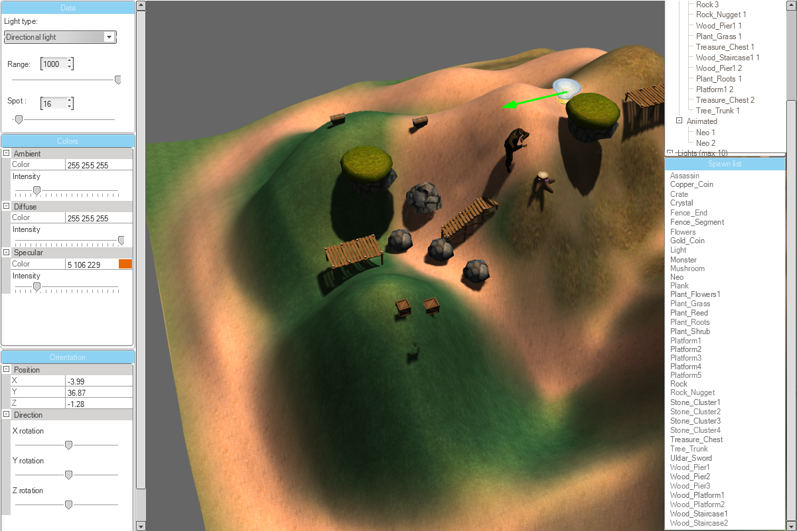

# Graphics Demo

A small graphics demo showcasing my old DirectX 11 renderer. The scene contains a small terrain which you can modify the height
and texture of and you can also place objects on it. The rendering is simple but supports shadows and vertex skinning.
In the editor you can modify properties of lights/object. Here's a short [**YouTube**](https://www.youtube.com/watch?v=OtyiMWQpZtg&ab_channel=AxelBlackert) demo.